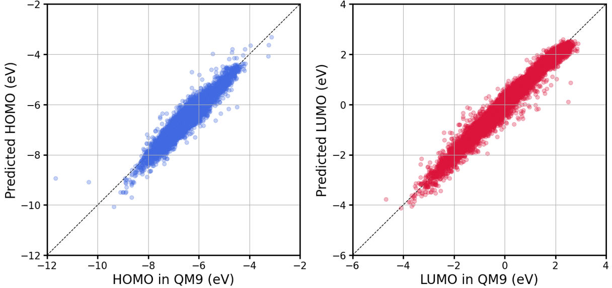

%20%7C%20macOS%20%7C%20Windows-lightgrey?style=plastic&logo=linux&logoColor=white)
[](https://www.python.org/downloads/)
[](https://developer.nvidia.com/cuda-toolkit)

[](https://numpy.org/)
[](https://pandas.pydata.org/)
[](https://github.com/tqdm/tqdm)
[](https://pytorch.org/)
[](https://huggingface.co/docs/transformers/index)

# SMILES-BERT-Predictor
SMILES-BERT-Predictor is a BERT-based framework for learning and predicting molecular properties, designed to accelerate material science research and chemical discovery.

### Platform Support
   - **Linux**: Recommended for command-line tools and model training with GPU.
   - **macOS**: Fully supported, but some command-line tools may need adaptation.
   - **Windows**: Python API works well, but Linux-based commands may require adjustment.

### Prerequisites
   - **Python**: 3.9 or later
   - **CUDA**: 12.2 or later
   - **PyTorch**: 2.7.0 or later
   - **Transformers**: 4.57.1 or later
   - **NumPy**: 2.1.0 or later
   - **Pandas**: 2.2.2 or later
   - **tqdm**: 4.67.0 or later
   - **Miniconda/Conda**: It is recommended to use Miniconda or Conda to create an isolated environment for this package.

# Installation
### 1. Install Miniconda:
If you do not have **Miniconda** installed, you can download it from [Miniconda Downloads](https://docs.conda.io/en/latest/miniconda.html) and follow the installation instructions for your operating system.

### 2. Create a virtual environment:
It is recommended to create a virtual environment to manage dependencies.
   ```bash
   # Create a virtual environment
   conda create -n smipred python=3.9 -y

   # Activate the virtual environment**
   conda activate smipred
   ```

### 3. Clone this repository:
If you don't have Git installed, please install it from Git Downloads.
   ```bash
   git clone https://github.com/wkdghdus23/SMILES-BERT-Predictor.git
   ```

### 4. Move to the SMILES-BERT-Predictor folder:
   ```bash
   cd (path/to/your/package)/SMILES-BERT-Predictor/smipred
   ```

### 5. Install the package:
   ```bash
   pip install -e .
   ```
**Ensure that your device's GPU CUDA version is compatible with the PyTorch CUDA version.** See the [PyTorch website](https://pytorch.org/) for more information.
To check CUDA version compatibility, you can use the following commands:
   ```bash
   # Check CUDA version installed on your system
   nvidia-smi

   # Check the CUDA version supported by PyTorch
   python -c "import torch; print(torch.version.cuda)"
   ```

### 6. Add the Python path to your environment:
   - **Step 1**. Create an activation script that sets the `PYTHONPATH` every time the environment is activated:
   ```bash
   mkdir -p $CONDA_PREFIX/etc/conda/activate.d
   echo 'unset PYTHONPATH' >> $CONDA_PREFIX/etc/conda/activate.d/env_vars.sh
   echo 'export PYTHONPATH=$PYTHONPATH:(path/to/your/package)/SMILES-BERT-Predictor/' >> $CONDA_PREFIX/etc/conda/activate.d/env_vars.sh
   ```
   - **Step 2**. Create a deactivation script to unset `PYTHONPATH` when the environment is deactivated:
   ```bash
   mkdir -p $CONDA_PREFIX/etc/conda/deactivate.d
   echo 'unset PYTHONPATH' >> $CONDA_PREFIX/etc/conda/deactivate.d/env_vars.sh
   ```
   This will make sure that the `PYTHONPATH` variable is cleared when the environment is deactivated, preventing any unwanted effect on other environments or system-level Python sessions.
   - **Step 3**. Restart your virtual environment
   After adding the activation and deactivation scripts, you need to **deactivate and reactivate** your virtual environment for the changes to take effect.
   You can do this by running:
   ```
   conda deactivate
   conda activate smipred
   ```
   This step is necessary because the environment variables set by the activation script are only applied when the environment is first activated.

### 7. Verify the installation:
   ```bash
   python -c "import smipred; print('SMILES-BERT-Predictor package installed successfully.')"
   ```

# Usage
### Command Line Arguments
   - `--task`: The task type to perform. Options are:
      - `mlm`: Masked Language Modeling to predict masked tokens.
      - `downstream`: Train a downstream model to predict chemical properties.
   - `--pretrained`: Path to a pre-trained model. Used as the starting point for fine-tuning or `downstream` tasks.
   - `--dataset`: Path to the dataset file in `.csv` format.
   - `--vocabfile`: Path to the vocabulary file used for tokenizing the string data (default: `./vocab.txt`).
   - `--max_len`: The maximum sequence length for tokenization.
   - `--batchsize`: Batch size for training.
   - `--epochs`: Number of epochs for training.
   - `--modelsavepath`: Path where the trained or fine-tuned model will be saved.
   - `--masking`: Masking ratio for MLM tasks. **Only used for the `mlm` task.** This defines the proportion of tokens in the input that will be masked (e.g., `0.15` means 15% of the tokens will be masked).
   - `--target`: List of target properties for downstream tasks. **Only used for the `downstream` task**. Specifies which chemical properties to predict during the downstream task (e.g., `--target HOMO LUMO`).

### Task 1. Train the Masked Language Model (MLM) using the QM9 dataset
In this example, you will train a Masked Language Model (MLM) using the QM9 dataset. The MLM task involves masking certain parts of the input data and training the model to predict these masked parts. This helps the model learn contextual embeddings for chemical structures, which can be useful for `downstream` tasks such as property prediction.

Before running the examples, navigate to the example directory, which contains the QM9 dataset.
   ```bash
   cd (path/to/your/package)/SMILES-BERT-Predictor/example
   ```

Perform the `mlm` training task with the following parameters:

   - **Masking ratio**: 15% of the tokens are masked.
   - **Batch size**: 64 (The number of samples processed before the model is updated).
   - **Epochs**: 10 (The number of complete passes through the entire dataset).
   - **Dataset**: QM9 dataset in CSV format.
   ```bash
   smipred --task mlm --masking 0.15 --batchsize 64 --epochs 10 --dataset ./QM9.csv > mlm.log
   ```

### Task 2. Load pre-trained MLM and train the downstream model (HOMO and LUMO values in QM9 dataset)
After training the `mlm`, you can use it for `downstream` tasks. In this example, you will load the pre-trained MLM and train a `downstream` model to predict the HOMO and LUMO values in the QM9 dataset.

Perform the `downstream` training task with the following parameters:

   - **Target**: HOMO and LUMO values.
   - **Batch size**: 64 (The number of samples processed before the model is updated).
   - **Epochs**: 10 (The number of complete passes through the entire dataset).
   - **Dataset**: QM9 dataset in CSV format.
   - **Pre-trained Model**: The path to the pre-trained MLM model.
   ```bash
   smipred --task downstream --target HOMO LUMO --batchsize 64 --epochs 10 --dataset ./QM9.csv --pretrained (path/to/pre-trained/model) > downstream.log
   ```

### Model Performance
The performance of the SMILES-BERT-Predictor was evaluated on the prediction of HOMO and LUMO energy levels. The scatter plots below illustrate the correlation between the calculated and predicted values for the HOMO and LUMO levels.
   - **HOMO Prediction (Left):**
      - R² score: 0.872
      - MAE: 167 meV
   - **LUMO Prediction (Right):**
      - R² score: 0.974
      - MAE: 152 meV



### Task 3. Load Trained Model and Predict Chemical Properties
This section demonstrates how to **load a pre-trained model** and use it to **predict HOMO and LUMO** properties of given molecules.
   ```python
   import os
   import torch
   import pandas as pd
   from transformers import BertTokenizer
   from smipred.tokenizer import Tokenizer
   from smipred.model import BertForDownstream
   
   # Define the target properties to predict
   target_name = ['HOMO', 'LUMO']
   
   # --- 1. Load Tokenizer ---
   # Path to the directory containing model results and vocabulary
   pretrained_model_path = '(path/to/your/pretrained/model)'
   vocab_file = f"{pretrained_model_path}/../../vocab.txt"
   
   # Initialize the BERT tokenizer with the specific vocabulary
   tokenizer = BertTokenizer(vocab_file=vocab_file,
                             clean_up_tokenization_spaces=True,
                             do_lower_case=False,   # SMILES are case-sensitive (e.g., 'c' vs 'C')
                             do_basic_tokenize=False)
   
   # --- 2. Load Model ---
   # Initialize the model architecture for the downstream task (Property Prediction)
   model = BertForDownstream.from_pretrained_model(
       pretrained_path=pretrained_model_path, 
       tokenizer=tokenizer, 
       target_name=target_name)
   
   # Find the checkpoint file (.pt) in the directory
   # This assumes there is at least one .pt file in the specified path
   model_files = [f for f in os.listdir(pretrained_model_path) if f.endswith('.pt')]
   
   if not model_files:
       raise FileNotFoundError(f"No .pt file found in {pretrained_model_path}")
   
   # Load the weights (state_dict) from the first found checkpoint
   state_dict_path = os.path.join(pretrained_model_path, model_files[0])
   state_dict = torch.load(state_dict_path, map_location=torch.device('cpu'))
   model.load_state_dict(state_dict)
   
   # --- 3. Prepare Input Data ---
   # List of SMILES strings to predict properties for
   input_data = [
       'O=C=O',
       'C(=O)N',
       "O=[S][N]S[N][S]=O"
   ]
   
   # Tokenize the input SMILES strings
   inputs = Tokenizer(smiles=input_data, 
                      vocab_file=vocab_file, 
                      tokenizer=tokenizer, 
                      max_len=256)
   
   # Convert tokenized lists to PyTorch tensors
   input_ids = torch.tensor(inputs['input_ids'], dtype=torch.long)
   attention_mask = torch.tensor(inputs['attention_mask'], dtype=torch.long)
   
   
   # --- 4. Perform Prediction ---
   model.eval()  # Set the model to evaluation mode (disables Dropout, etc.)
   
   with torch.no_grad():
       outputs = model(input_ids=input_ids, attention_mask=attention_mask).numpy()
   
   
   # --- 5. Display Results ---
   # Create a DataFrame to neatly display the SMILES and their predicted values
   prediction_df = pd.DataFrame(index=input_data, columns=target_name, data=outputs)
   display(prediction_df)
   ```

# Features
- **Masked Language Modeling (MLM)**: Predict masked tokens in strings using a BERT-based architecture.
- **Downstream Property Prediction**: Predict chemical properties using a pre-trained model.
- **Easy Integration**: Command-line interface (CLI) and Python API for seamless integration into your workflows.
- **GPU Acceleration**: Utilize CUDA-enabled GPUs to significantly speed up training and prediction.

**Note**: This project is designed as an introductory tutorial, allowing users to easily explore and experience BERT-based modeling for molecular property prediction. It aims to provide a straightforward and hands-on approach for beginners interested in machine learning applications in chemistry.

**At this time, contributions and GitHub issues are not required or actively monitored, as the primary focus is on providing a self-contained tutorial resource.** I appreciate your understanding and hope this project helps you get started with BERT-based modeling.

# License
This project is licensed under the MIT License. See the [LICENSE](LICENSE) file for more details.
